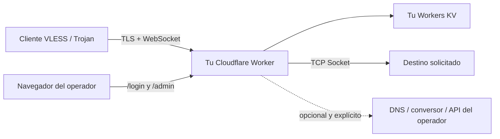

# EdgeTunnel

<p align="center">
  Un túnel VLESS y Trojan sobre WebSocket para Cloudflare Workers, autohospedado y bajo control del operador.
</p>

<p align="center">
  <a href="README.md">English</a> ·
  <a href="README.zh-CN.md">简体中文</a> ·
  <a href="README.es.md">Español</a> ·
  <a href="README.fa.md">فارسی</a>
</p>

<p align="center">
  
  
  
</p>

> [!IMPORTANT]
> EdgeTunnel está destinado al estudio, aprendizaje y acceso lícito a sistemas que estés autorizado a utilizar. Es responsabilidad del usuario cumplir la legislación, los términos de Cloudflare y las políticas de red aplicables.

## Qué es este proyecto

EdgeTunnel es un Cloudflare Worker modular. Acepta **VLESS sobre WebSocket/TLS** y **Trojan sobre WebSocket/TLS**, y abre conexiones TCP salientes mediante la API Socket de Cloudflare. La configuración, las sesiones, la lista de direcciones y los registros se guardan en un espacio Workers KV propiedad del operador.

Durante la ejecución no descarga código ni un panel desde otros repositorios GitHub o CDN. Las integraciones remotas permanecen desactivadas hasta que el administrador configure explícitamente servicios bajo su control.

### Estado actual

| Área | Estado |
| --- | --- |
| VLESS sobre WebSocket/TLS | Compatible |
| Trojan sobre WebSocket/TLS | Compatible |
| TCP saliente con Cloudflare Sockets | Compatible |
| Inicio de sesión, sesiones KV y cierre de sesión | Compatible |
| Suscripciones protegidas por token | Compatible |
| Suscripción basada en una lista local | Compatible |
| Conversión para Mihomo/Clash, Sing-box y Surge | Opcional; necesita un conversor del operador |
| Consola gráfica de administración | Aún no implementada; la página actual ofrece JSON y texto locales |
| Hysteria2, TUIC y otros protocolos QUIC/UDP nativos | No compatibles con esta arquitectura |

> [!NOTE]
> La ruta `/admin` es actualmente una página mínima e independiente. No contiene un editor gráfico de nodos. Esta guía explica cómo leer y cambiar la configuración sin depender de un panel externo.

## Arquitectura y límite de confianza



Servicios obligatorios:

- Cloudflare Workers.
- Un espacio Workers KV enlazado con el nombre exacto `KV`.

Integraciones opcionales, desactivadas de forma predeterminada:

- DNS propio para el reenvío DNS de VLESS.
- Conversor de suscripciones y archivo de configuración propios.
- Punto de comprobación de proxy propio.
- API de ubicaciones propia.
- DoH HTTPS elegido por el operador al activar ECH.
- Telegram, sitio de camuflaje remoto o API de consumo de Cloudflare.

## Requisitos

- Una cuenta Cloudflare con Workers habilitado.
- Node.js y npm.
- Git.
- Una terminal.

Cloudflare recomienda instalar Wrangler dentro de cada proyecto. Los comandos siguientes usan `npx` para seleccionar esa versión local.

## Despliegue completo

### 1. Clonar el repositorio

```bash
git clone https://github.com/tianrking/Re_edgetunnel.git
cd Re_edgetunnel
```

### 2. Instalar Wrangler localmente

```bash
npm install --save-dev wrangler@latest
npx wrangler --version
```

Se recomienda Wrangler 4.x o superior.

### 3. Autorizar la cuenta Cloudflare

```bash
npx wrangler login
npx wrangler whoami
```

El primer comando abre la autorización en el navegador; el segundo confirma la cuenta activa.

### 4. Crear y enlazar un KV dedicado

```bash
npx wrangler kv namespace create KV
```

Copia el ID que imprime Wrangler y reemplaza el marcador en `wrangler.toml`:

```toml
[[kv_namespaces]]
binding = "KV"
id = "pega-aqui-el-id-del-namespace"
```

El nombre `binding` debe seguir siendo `KV`, porque el código utiliza `env.KV`.

Usa espacios KV distintos para pruebas y producción. Compartirlo implica compartir configuración, sesiones, direcciones y registros.

### 5. Validar y crear el Worker

```bash
npm test
npm run check
npx wrangler deploy --dry-run
npx wrangler deploy
```

El primer despliegue crea el Worker. Mientras `ADMIN` no exista, las peticiones HTTP responden intencionadamente con `503 Administrator password is not configured.`

### 6. Guardar la contraseña administrativa como Secret

Puedes generar una contraseña robusta localmente:

```bash
node -e "console.log(require('node:crypto').randomBytes(32).toString('base64url'))"
```

Guárdala de forma interactiva:

```bash
npx wrangler secret put ADMIN
```

No escribas el valor en el código ni en `wrangler.toml`. Wrangler solicita el valor y despliega inmediatamente una nueva versión.

### 7. Guardar un UUID v4 independiente

El UUID es la credencial VLESS y también la contraseña de Trojan:

```bash
node -e "console.log(require('node:crypto').randomUUID())"
npx wrangler secret put UUID
```

`ADMIN` y `UUID` deben ser diferentes. Al cambiar el UUID, los enlaces y suscripciones antiguos dejan de funcionar.

Comprueba los nombres de los secretos:

```bash
npx wrangler secret list
```

Cloudflare muestra los nombres, pero nunca sus valores.

### 8. Abrir el Worker

Wrangler muestra una dirección similar a:

```text
https://edgetunnel.<tu-subdominio-workers>.workers.dev
```

La raíz muestra normalmente una página de camuflaje estilo nginx. Es el comportamiento esperado. Abre:

```text
https://edgetunnel.<tu-subdominio-workers>.workers.dev/login
```

Inicia sesión con `ADMIN` y visita `/admin`.

## Primer uso: nodo y suscripción

### Copiar un nodo individual

1. Inicia sesión y abre `/admin`.
2. Selecciona **Configuration JSON**.
3. Busca el campo superior `LINK`.
4. Copia el URI completo `vless://...` o `trojan://...`.
5. Impórtalo en un cliente compatible.

El protocolo predeterminado es VLESS. El enlace ya contiene host, TLS, WebSocket, ruta y UUID.

### Crear la URL de suscripción

En el mismo JSON busca:

```text
优选订阅生成.TOKEN
```

Construye la URL:

```text
https://HOST_DEL_WORKER/sub?token=TOKEN
```

Esta URL es una credencial. No la publiques, no la incluyas en capturas y no la subas a Git.

### Formatos de salida

| Salida | Sufijo | Requisito |
| --- | --- | --- |
| Lista URI sin codificar en el navegador | `/sub?token=TOKEN` | Sin servicio externo |
| Suscripción URI en Base64 | `/sub?token=TOKEN&base64` | Sin servicio externo |
| YAML de Mihomo/Clash | `/sub?token=TOKEN&clash` | `SUBAPI` y `SUBCONFIG` propios |
| JSON de Sing-box | `/sub?token=TOKEN&singbox` | `SUBAPI` y `SUBCONFIG` propios |
| Configuración Surge | `/sub?token=TOKEN&surge` | `SUBAPI` y `SUBCONFIG` propios |
| Quantumult X | `/sub?token=TOKEN&quanx` | `SUBAPI` y `SUBCONFIG` propios |
| Loon | `/sub?token=TOKEN&loon` | `SUBAPI` y `SUBCONFIG` propios |

Mihomo, Sing-box y Surge son formatos de configuración de cliente, no nuevos protocolos de entrada. Sin un conversor configurado, el Worker responde HTTP 501 y no usa silenciosamente un conversor público.

## Administración actual

Las rutas administrativas necesitan una sesión válida almacenada en KV. La sesión caduca a las 24 horas y el cierre de sesión la revoca inmediatamente.

| Ruta | Método | Función |
| --- | --- | --- |
| `/login` | GET, POST | Formulario local y creación de sesión |
| `/admin` | GET | Índice administrativo mínimo |
| `/admin/config.json` | GET | Configuración efectiva, `LINK` y token |
| `/admin/config.json` | POST | Guardar configuración completa en KV |
| `/admin/ADD.txt` | GET | Leer direcciones guardadas o generadas localmente |
| `/admin/ADD.txt` | POST | Guardar la lista propia del operador |
| `/admin/log.json` | GET | Leer registros de peticiones |
| `/admin/init` | POST | Restablecer `config.json`; no elimina direcciones ni registros |
| `/admin/check` | GET | Probar un proxy ascendente con un endpoint propio |
| `/logout` | GET | Revocar sesión y borrar cookie |

Los POST que cambian datos exigen un encabezado `Origin` o `Referer` del mismo origen. Es una protección CSRF.

### Cambiar la configuración desde el navegador

Después de iniciar sesión, abre `/admin` y la consola de desarrollo del navegador:

```js
const config = await fetch('/admin/config.json').then((response) => response.json());

// Ejemplo: generar enlaces Trojan en lugar de VLESS.
config.协议类型 = 'trojan';

const response = await fetch('/admin/config.json', {
  method: 'POST',
  headers: { 'Content-Type': 'application/json' },
  body: JSON.stringify(config),
});

console.log(response.status, await response.text());
```

Una operación correcta devuelve `{"success":true}`. Vuelve a cargar `/admin/config.json` para verificarla.

### Guardar una lista de direcciones propia

Formato por línea:

```text
host-o-ip:puerto#nombre visible
```

Ejemplos:

```text
example.com:443#Principal
203.0.113.10:443#Ejemplo IPv4
[2001:db8::10]:443#Ejemplo IPv6
```

Las direcciones anteriores son ejemplos reservados para documentación. Sustitúyelas por destinos que estés autorizado a usar. Se ignoran líneas inválidas y puertos fuera de `1-65535`.

```js
const addresses = `example.com:443#Principal
203.0.113.10:443#Respaldo`;

const response = await fetch('/admin/ADD.txt', {
  method: 'POST',
  headers: { 'Content-Type': 'text/plain; charset=utf-8' },
  body: addresses,
});

console.log(response.status, await response.text());
```

### Restablecer la configuración principal

```js
const response = await fetch('/admin/init', { method: 'POST' });
console.log(response.status, await response.text());
```

Solo restablece `config.json`. No borra `ADD.txt`, registros, sesiones, Telegram ni los ajustes de consumo Cloudflare.

## Campos principales del JSON

| Campo | Predeterminado | Significado |
| --- | --- | --- |
| `协议类型` | `vless` | `vless` o `trojan` para los enlaces generados |
| `传输协议` | `ws` | Transporte WebSocket |
| `HOSTS` | Host del Worker | Dominios usados en suscripciones |
| `跳过证书验证` | `false` | Desactiva la validación del certificado; no recomendado |
| `启用0RTT` | `false` | Añade datos tempranos a la ruta WebSocket |
| `随机路径` | `false` | Usa `/` para los nodos locales cuando se activa |
| `Fingerprint` | `chrome` | Sugerencia de huella TLS para el cliente |
| `ECH` | `false` | Genera opciones ECH solo con DoH HTTPS explícito |
| `优选订阅生成.local` | `true` | Genera desde la lista local en KV |
| `优选订阅生成.SUBNAME` | `edgetunnel` | Nombre visible del nodo y la suscripción |
| `优选订阅生成.SUBUpdateTime` | `3` | Intervalo recomendado de actualización, en horas |
| `订阅转换配置.SUBAPI` | `null` | URL base del conversor propio |
| `订阅转换配置.SUBCONFIG` | `null` | Configuración HTTPS del conversor propio |
| `本地规则集URL` | `null` | Base propia para reglas `.srs` de Sing-box |
| `客户端DNS` | `[]` | DNS que se añaden explícitamente al resultado Clash |
| `TG.启用` | `false` | Activa avisos Telegram después de configurar credenciales |

`HOST`, `UUID`, `PATH`, `LINK`, `TOKEN`, tiempos y consumo son valores derivados. El Worker puede recalcularlos al leer el JSON guardado.

## Variables de despliegue

Usa `wrangler secret put` para datos sensibles. Los ajustes no sensibles pueden ir en `[vars]` dentro de `wrangler.toml`.

| Variable | Obligatoria | Uso |
| --- | --- | --- |
| `ADMIN` | Sí | Contraseña administrativa; Secret |
| `UUID` | Muy recomendada | Credencial RFC 4122 v4; Secret |
| `KEY` | No | Entrada secreta adicional y atajo privado opcional; Secret |
| `HOST` | No | Hosts separados por coma o salto de línea |
| `URL` | No | Camuflaje raíz: `nginx`, `1101` u origen HTTPS explícito |
| `PROXYIP` | No | Proxy TCP de respaldo seleccionado por el operador |
| `DNS_RESOLVER` | No | DNS propio para reenvío DNS de VLESS |
| `DNS_RESOLVER_PORT` | No | Puerto DNS; `53` por defecto |
| `PROXY_CHECK_HOST` | No | Host propio usado para comprobar proxies |
| `PROXY_CHECK_PORT` | No | Puerto de comprobación; `80` por defecto |
| `PROXY_CHECK_PATH` | No | Ruta HTTP de comprobación; `/` por defecto |
| `LOCATIONS_API` | No | API HTTPS propia de ubicaciones |
| `ECH_DOH_URL` | No | DoH HTTPS explícito usado únicamente para ECH |
| `ALLOW_REMOTE_USAGE_API` | No | Debe ser `true` para permitir una API remota de consumo guardada |

Si falta un endpoint opcional, la función correspondiente permanece desactivada; no existe un servicio público oculto de respaldo.

## Dominio personalizado

Añade a `wrangler.toml` un dominio administrado en la misma cuenta Cloudflare:

```toml
routes = [
  { pattern = "tunnel.example.com", custom_domain = true }
]
```

```bash
npx wrangler deploy
```

Después del cambio, vuelve a leer `/admin/config.json`. El token depende del hostname y UUID, por lo que el token de `workers.dev` no sirve para el dominio personalizado.

## Actualización y reversión

```bash
git pull --ff-only
npm test
npm run check
npx wrangler deploy --dry-run
npx wrangler deploy
```

```bash
npx wrangler versions list
npx wrangler rollback
```

Guarda copias de `config.json` y `ADD.txt` antes de cambios destructivos.

## Límites de protocolo

Compatible:

- VLESS y Trojan sobre WebSocket con TLS terminado por Cloudflare.
- Destinos TCP accesibles con la API Socket de Cloudflare.
- DNS de VLESS cuando existe un DNS propio explícito.
- SOCKS5 y HTTP CONNECT como proxies **ascendentes**, no como protocolos de entrada.

No compatible:

- Hysteria2 y TUIC, que necesitan QUIC/UDP nativo.
- WireGuard entrante.
- VLESS Reality, porque Cloudflare termina TLS.
- Entrada proxy TCP nativa, gRPC, HTTP/2 o HTTP/3.
- UDP arbitrario; únicamente la ruta DNS VLESS configurada.

Añadir un formato de cliente no añade un protocolo de red al núcleo.

## Seguridad

- Sesiones con tokens aleatorios de 256 bits y claves derivadas con SHA-256 en KV.
- Cookies `HttpOnly`, `Secure` y `SameSite=Strict`.
- Caducidad de 24 horas y revocación al cerrar sesión.
- Mutaciones administrativas limitadas al mismo origen.
- Suscripciones protegidas por un token derivado del hostname y UUID.
- Eliminación de credenciales de las URL guardadas en registros.
- Integraciones remotas solo mediante configuración explícita.

Recomendaciones:

- Nunca confirmes en Git `ADMIN`, `UUID`, tokens API, cookies o enlaces de suscripción.
- Mantén `跳过证书验证=false`.
- Separa Worker y KV de pruebas y producción.
- Cambia `ADMIN` después de una filtración. Las sesiones ya activas duran hasta el cierre o 24 horas.
- Cambia `UUID` si se filtra un nodo y vuelve a importarlo en todos los clientes.
- Concede permisos mínimos a los tokens API de Cloudflare.

## Solución de problemas

### La raíz muestra “Welcome to nginx”

Es el camuflaje predeterminado. Abre `/login`.

### `/admin` solo muestra unos enlaces

Ese es el panel incorporado actual. El nodo y token están en `/admin/config.json`; usa los ejemplos anteriores para modificar datos. La versión actual no afirma incluir un editor gráfico completo.

### `503 Administrator password is not configured`

```bash
npx wrangler secret put ADMIN
```

### Error de enlace KV

Comprueba que `wrangler.toml` contenga un ID real y que el binding se llame exactamente `KV`.

### `403 Invalid Token`

Copia de nuevo el token desde el mismo hostname. Un dominio personalizado y el hostname `workers.dev` generan tokens diferentes.

### Clash, Sing-box o Surge responde `501`

Configura `订阅转换配置.SUBAPI` y `SUBCONFIG` con servicios HTTPS propios. Las salidas URI y Base64 no necesitan conversor.

### La prueba de proxy responde `503`

Configura `PROXY_CHECK_HOST`, `PROXY_CHECK_PORT` y `PROXY_CHECK_PATH` con tu endpoint. No se usa un comprobador público automáticamente.

### WebSocket conecta pero el destino no responde

Revisa UUID/contraseña, host/SNI TLS, host y ruta WebSocket, puerto de destino, registros Cloudflare y las restricciones de salida de Cloudflare.

```bash
npx wrangler tail
```

## Desarrollo y pruebas

```bash
npm run check
npm test
```

Pruebas contra un entorno Cloudflare dedicado:

```bash
npm run test:cloudflare:http
npm run test:cloudflare
```

Estas pruebas requieren un Worker, KV y credenciales temporales. No ejecutes pruebas destructivas sobre producción.

## Estructura

```text
src/
├── index.js                 # Entrada y rutas
├── config.js                # Configuración, KV, enlaces y registros
├── controllers/             # Autenticación, administración, suscripciones
├── core/proxy.js            # Ciclo WebSocket y Socket saliente
├── protocols/               # VLESS, Trojan, SOCKS5 y HTTP ascendente
└── utils/                   # Páginas, direcciones, parches y utilidades
```

## Agradecimientos

Inspirado por el trabajo comunitario de:

- [cmliu/edgetunnel](https://github.com/cmliu/edgetunnel)
- [zizifn/edgetunnel](https://github.com/zizifn/edgetunnel)

El código actual está modularizado dentro de este repositorio y no carga esos repositorios durante la ejecución.

## Licencia y aviso

Consulta [LICENSE](LICENSE). Utiliza este software únicamente con fines legales y en sistemas y redes que estés autorizado a usar. Los mantenedores no se responsabilizan del uso indebido ni de las pérdidas resultantes.
