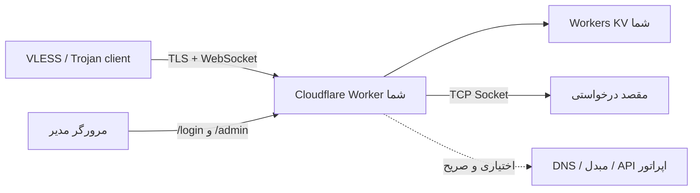

# EdgeTunnel

<p align="center" dir="rtl">
  تونل خودمیزبان VLESS و Trojan بر بستر WebSocket برای Cloudflare Workers، تحت کنترل کامل اپراتور.
</p>

<p align="center">
  <a href="README.md">English</a> ·
  <a href="README.zh-CN.md">简体中文</a> ·
  <a href="README.es.md">Español</a> ·
  <a href="README.fa.md">فارسی</a>
</p>

<p align="center">
  
  
  
</p>

> [!IMPORTANT]
> EdgeTunnel برای پژوهش، آموزش و دسترسی قانونی به سامانه‌هایی طراحی شده است که اجازهٔ استفاده از آن‌ها را دارید. رعایت قوانین، شرایط Cloudflare و سیاست‌های شبکه بر عهدهٔ کاربر است.

## این پروژه چیست؟

EdgeTunnel یک Cloudflare Worker ماژولار است. این Worker اتصال‌های **VLESS روی WebSocket/TLS** و **Trojan روی WebSocket/TLS** را دریافت می‌کند و با Socket API کلادفلر اتصال TCP خروجی می‌سازد. تنظیمات، نشست‌های ورود، فهرست آدرس‌ها و گزارش درخواست‌ها در Workers KV متعلق به خود اپراتور ذخیره می‌شوند.

در زمان اجرا هیچ کد، پنل مدیریت یا تنظیماتی از مخزن GitHub یا CDN دیگر بارگیری نمی‌شود. سرویس‌های راه‌دور تا زمانی که مدیر نشانی سرویس تحت کنترل خود را وارد نکند غیرفعال می‌مانند.

### وضعیت فعلی

| بخش | وضعیت |
| --- | --- |
| VLESS روی WebSocket/TLS | پشتیبانی می‌شود |
| Trojan روی WebSocket/TLS | پشتیبانی می‌شود |
| TCP خروجی با Cloudflare Sockets | پشتیبانی می‌شود |
| ورود با رمز، نشست KV و خروج | پشتیبانی می‌شود |
| اشتراک محافظت‌شده با token | پشتیبانی می‌شود |
| اشتراک بر پایهٔ فهرست آدرس محلی | پشتیبانی می‌شود |
| تبدیل Mihomo/Clash، Sing-box و Surge | اختیاری؛ نیازمند مبدل تحت کنترل اپراتور |
| پنل گرافیکی مدیریت | هنوز پیاده‌سازی نشده؛ صفحهٔ فعلی JSON و متن محلی ارائه می‌کند |
| Hysteria2، TUIC و پروتکل‌های بومی QUIC/UDP | در این معماری پشتیبانی نمی‌شوند |

> [!NOTE]
> مسیر `/admin` در نسخهٔ فعلی یک صفحهٔ کوچک و کاملاً داخلی است و ویرایشگر گرافیکی نود ندارد. این راهنما روش مشاهده و تغییر تنظیمات را بدون وابستگی به پنل شخص ثالث توضیح می‌دهد.

## معماری و مرز اعتماد



وابستگی‌های الزامی:

- Cloudflare Workers.
- یک Workers KV با نام اتصال دقیق `KV`.

یکپارچه‌سازی‌های اختیاری که به‌طور پیش‌فرض خاموش‌اند:

- DNS متعلق به اپراتور برای انتقال DNS در VLESS.
- مبدل اشتراک و فایل تنظیمات متعلق به اپراتور.
- مقصد بررسی پراکسی متعلق به اپراتور.
- API اطلاعات موقعیت متعلق به اپراتور.
- DoH مبتنی بر HTTPS که هنگام فعال‌سازی ECH صریحاً انتخاب شود.
- اعلان Telegram، سایت پوششی راه‌دور یا API مصرف Cloudflare.

## پیش‌نیازها

- حساب Cloudflare با Workers فعال.
- Node.js و npm.
- Git.
- ترمینال.

Cloudflare نصب Wrangler در داخل هر پروژه را توصیه می‌کند. فرمان‌های زیر از `npx` استفاده می‌کنند تا نسخهٔ محلی پروژه اجرا شود.

## راهنمای کامل استقرار

### ۱. دریافت مخزن

```bash
git clone https://github.com/tianrking/Re_edgetunnel.git
cd Re_edgetunnel
```

### ۲. نصب محلی Wrangler

```bash
npm install --save-dev wrangler@latest
npx wrangler --version
```

Wrangler نسخهٔ 4.x یا جدیدتر توصیه می‌شود.

### ۳. ورود به Cloudflare

```bash
npx wrangler login
npx wrangler whoami
```

فرمان اول صفحهٔ تأیید مرورگر را باز می‌کند و فرمان دوم حساب فعال را نشان می‌دهد.

### ۴. ساخت و اتصال KV اختصاصی

```bash
npx wrangler kv namespace create KV
```

Wrangler یک شناسه چاپ می‌کند. مقدار نمونه را در `wrangler.toml` جایگزین کنید:

```toml
[[kv_namespaces]]
binding = "KV"
id = "شناسه-KV-را-اینجا-قرار-دهید"
```

نام `binding` باید دقیقاً `KV` باقی بماند، زیرا برنامه از `env.KV` استفاده می‌کند.

برای آزمایش و تولید KV جداگانه بسازید. استفاده از KV مشترک به معنی اشتراک تنظیمات، نشست‌ها، فهرست آدرس و گزارش‌هاست.

### ۵. اعتبارسنجی و ساخت Worker

```bash
npm test
npm run check
npx wrangler deploy --dry-run
npx wrangler deploy
```

استقرار اول Worker را ایجاد می‌کند. تا پیش از تعریف `ADMIN`، پاسخ `503 Administrator password is not configured.` عمدی است و نشانهٔ خرابی نیست.

### ۶. ذخیرهٔ رمز مدیریت به‌صورت Secret

برای تولید مقدار قوی در دستگاه خود:

```bash
node -e "console.log(require('node:crypto').randomBytes(32).toString('base64url'))"
```

آن را تعاملی ذخیره کنید:

```bash
npx wrangler secret put ADMIN
```

مقدار واقعی را در کد یا `wrangler.toml` ننویسید. Wrangler مقدار را در prompt دریافت و نسخهٔ جدید Worker را فوراً مستقر می‌کند.

### ۷. ذخیرهٔ UUID نسخهٔ ۴ مستقل

UUID شناسهٔ VLESS و رمز Trojan است:

```bash
node -e "console.log(require('node:crypto').randomUUID())"
npx wrangler secret put UUID
```

مقادیر `ADMIN` و `UUID` باید متفاوت باشند. تغییر UUID تمام لینک‌ها و اشتراک‌های قدیمی را نامعتبر می‌کند.

نام Secretها را بررسی کنید:

```bash
npx wrangler secret list
```

Cloudflare فقط نام Secretها را نمایش می‌دهد، نه مقدارشان را.

### ۸. باز کردن Worker

Wrangler نشانی مشابه زیر نمایش می‌دهد:

```text
https://edgetunnel.<workers-subdomain>.workers.dev
```

صفحهٔ اصلی معمولاً نمای پوششی nginx را نشان می‌دهد و این طبیعی است. برای ورود، نشانی زیر را باز کنید:

```text
https://edgetunnel.<workers-subdomain>.workers.dev/login
```

با مقدار `ADMIN` وارد شوید و سپس `/admin` را باز کنید.

## نخستین استفاده: نود و اشتراک

### دریافت لینک یک نود

1. وارد شوید و `/admin` را باز کنید.
2. روی **Configuration JSON** بزنید.
3. فیلد سطح اول `LINK` را پیدا کنید.
4. کل URI با آغاز `vless://...` یا `trojan://...` را کپی کنید.
5. آن را در کلاینت سازگار وارد کنید.

پروتکل پیش‌فرض VLESS است. لینک تولیدشده شامل دامنه، TLS، WebSocket، مسیر و UUID است.

### ساخت نشانی اشتراک

در همان JSON مقدار زیر را پیدا کنید:

```text
优选订阅生成.TOKEN
```

نشانی را بسازید:

```text
https://WORKER_HOST/sub?token=TOKEN
```

نشانی اشتراک یک اطلاعات محرمانه است. آن را عمومی نکنید، در تصویر قرار ندهید و به Git نفرستید.

### قالب‌های خروجی اشتراک

| خروجی | پسوند URL | نیازمندی |
| --- | --- | --- |
| فهرست خام URI در مرورگر | `/sub?token=TOKEN` | بدون سرویس بیرونی |
| اشتراک Base64 | `/sub?token=TOKEN&base64` | بدون سرویس بیرونی |
| Mihomo/Clash YAML | `/sub?token=TOKEN&clash` | `SUBAPI` و `SUBCONFIG` تحت کنترل اپراتور |
| Sing-box JSON | `/sub?token=TOKEN&singbox` | `SUBAPI` و `SUBCONFIG` تحت کنترل اپراتور |
| Surge | `/sub?token=TOKEN&surge` | `SUBAPI` و `SUBCONFIG` تحت کنترل اپراتور |
| Quantumult X | `/sub?token=TOKEN&quanx` | `SUBAPI` و `SUBCONFIG` تحت کنترل اپراتور |
| Loon | `/sub?token=TOKEN&loon` | `SUBAPI` و `SUBCONFIG` تحت کنترل اپراتور |

Mihomo، Sing-box و Surge قالب تنظیمات کلاینت‌اند، نه پروتکل ورودی جدید Worker. اگر مبدل تعریف نشده باشد، Worker پاسخ HTTP 501 می‌دهد و مخفیانه از سرویس عمومی استفاده نمی‌کند.

## استفاده از صفحهٔ مدیریت فعلی

مسیرهای مدیریت به نشست معتبر ذخیره‌شده در KV نیاز دارند. نشست پس از ۲۴ ساعت منقضی و با خروج فوراً باطل می‌شود.

| مسیر | روش | کاربرد |
| --- | --- | --- |
| `/login` | GET, POST | فرم ورود محلی و ایجاد نشست |
| `/admin` | GET | فهرست حداقلی مدیریت |
| `/admin/config.json` | GET | تنظیمات مؤثر، `LINK` و token اشتراک |
| `/admin/config.json` | POST | ذخیرهٔ کل JSON در KV |
| `/admin/ADD.txt` | GET | خواندن فهرست ذخیره‌شده یا فهرست محلی تولیدشده |
| `/admin/ADD.txt` | POST | ذخیرهٔ فهرست آدرس اپراتور |
| `/admin/log.json` | GET | مشاهدهٔ گزارش درخواست‌ها |
| `/admin/init` | POST | بازنشانی `config.json`؛ آدرس‌ها و گزارش‌ها حذف نمی‌شوند |
| `/admin/check` | GET | آزمایش پراکسی بالادستی با مقصد متعلق به اپراتور |
| `/logout` | GET | باطل کردن نشست و پاک کردن Cookie |

درخواست‌های POST تغییردهنده باید `Origin` یا `Referer` هم‌مبدأ داشته باشند. این محدودیت برای جلوگیری از CSRF است.

### ویرایش تنظیمات در مرورگر

پس از ورود، `/admin` و کنسول توسعه‌دهندهٔ مرورگر را باز کنید:

```js
const config = await fetch('/admin/config.json').then((response) => response.json());

// نمونه: تولید لینک Trojan به‌جای VLESS
config.协议类型 = 'trojan';

const response = await fetch('/admin/config.json', {
  method: 'POST',
  headers: { 'Content-Type': 'application/json' },
  body: JSON.stringify(config),
});

console.log(response.status, await response.text());
```

پاسخ موفق `{"success":true}` است. برای اطمینان `/admin/config.json` را دوباره بارگیری کنید.

### ذخیرهٔ فهرست آدرس شخصی

قالب هر خط:

```text
hostname-or-ip:port#نام نمایشی
```

نمونه:

```text
example.com:443#اصلی
203.0.113.10:443#نمونه IPv4
[2001:db8::10]:443#نمونه IPv6
```

آدرس‌های بالا ویژهٔ مستندات‌اند؛ آن‌ها را با مقصدی که اجازهٔ استفاده از آن را دارید جایگزین کنید. خطوط نامعتبر و پورت خارج از `1-65535` نادیده گرفته می‌شوند.

```js
const addresses = `example.com:443#اصلی
203.0.113.10:443#پشتیبان`;

const response = await fetch('/admin/ADD.txt', {
  method: 'POST',
  headers: { 'Content-Type': 'text/plain; charset=utf-8' },
  body: addresses,
});

console.log(response.status, await response.text());
```

### بازنشانی تنظیمات اصلی

```js
const response = await fetch('/admin/init', { method: 'POST' });
console.log(response.status, await response.text());
```

این فرمان فقط `config.json` را بازنشانی می‌کند و `ADD.txt`، گزارش‌ها، نشست‌ها، Telegram یا تنظیمات مصرف Cloudflare را حذف نمی‌کند.

## فیلدهای مهم تنظیمات

| فیلد JSON | پیش‌فرض | معنی |
| --- | --- | --- |
| `协议类型` | `vless` | پروتکل لینک تولیدی: `vless` یا `trojan` |
| `传输协议` | `ws` | انتقال WebSocket |
| `HOSTS` | دامنهٔ Worker | دامنه‌های مورد استفاده در اشتراک |
| `跳过证书验证` | `false` | غیرفعال‌کردن اعتبارسنجی گواهی؛ توصیه نمی‌شود |
| `启用0RTT` | `false` | افزودن early data به مسیر WebSocket |
| `随机路径` | `false` | استفاده از `/` برای نودهای محلی هنگام فعال‌سازی |
| `Fingerprint` | `chrome` | راهنمای اثر انگشت TLS کلاینت |
| `ECH` | `false` | تولید گزینهٔ ECH فقط با DoH صریح HTTPS |
| `优选订阅生成.local` | `true` | تولید اشتراک از فهرست محلی KV |
| `优选订阅生成.SUBNAME` | `edgetunnel` | نام نمایشی نود و اشتراک |
| `优选订阅生成.SUBUpdateTime` | `3` | فاصلهٔ پیشنهادی به‌روزرسانی بر حسب ساعت |
| `订阅转换配置.SUBAPI` | `null` | نشانی پایهٔ مبدل متعلق به اپراتور |
| `订阅转换配置.SUBCONFIG` | `null` | تنظیمات HTTPS مبدل متعلق به اپراتور |
| `本地规则集URL` | `null` | نشانی پایهٔ rule-setهای `.srs` در Sing-box |
| `客户端DNS` | `[]` | DNSهایی که صریحاً به خروجی Clash افزوده می‌شوند |
| `TG.启用` | `false` | فعال‌سازی اعلان Telegram پس از ذخیرهٔ اعتبارنامه |

مقادیر `HOST`، `UUID`، `PATH`، `LINK`، `TOKEN`، زمان و مصرف در زمان اجرا محاسبه می‌شوند و ممکن است هنگام خواندن JSON دوباره نوشته شوند.

## متغیرهای استقرار

اطلاعات حساس را با `wrangler secret put` ذخیره کنید. گزینه‌های غیرحساس می‌توانند در `[vars]` فایل `wrangler.toml` قرار گیرند.

| متغیر | الزامی | کاربرد |
| --- | --- | --- |
| `ADMIN` | بله | رمز مدیریت؛ به‌صورت Secret |
| `UUID` | قویاً توصیه می‌شود | اعتبارنامهٔ RFC 4122 v4؛ به‌صورت Secret |
| `KEY` | خیر | ورودی محرمانهٔ اضافه و میان‌بر خصوصی اختیاری؛ Secret |
| `HOST` | خیر | دامنه‌های جداشده با ویرگول یا خط جدید |
| `URL` | خیر | پوشش مسیر اصلی: `nginx`، `1101` یا مبدأ HTTPS صریح |
| `PROXYIP` | خیر | پراکسی TCP پشتیبان انتخاب‌شده توسط اپراتور |
| `DNS_RESOLVER` | خیر | DNS اپراتور برای انتقال DNS در VLESS |
| `DNS_RESOLVER_PORT` | خیر | پورت DNS؛ پیش‌فرض `53` |
| `PROXY_CHECK_HOST` | خیر | میزبان متعلق به اپراتور برای بررسی پراکسی |
| `PROXY_CHECK_PORT` | خیر | پورت بررسی؛ پیش‌فرض `80` |
| `PROXY_CHECK_PATH` | خیر | مسیر HTTP بررسی؛ پیش‌فرض `/` |
| `LOCATIONS_API` | خیر | API مکان مبتنی بر HTTPS و متعلق به اپراتور |
| `ECH_DOH_URL` | خیر | DoH صریح HTTPS فقط برای ECH |
| `ALLOW_REMOTE_USAGE_API` | خیر | باید `true` باشد تا API مصرف راه‌دور فراخوانی شود |

نبودن هر endpoint اختیاری، قابلیت مربوط را غیرفعال می‌کند. سرویس عمومی مخفی به‌عنوان جایگزین وجود ندارد.

## دامنهٔ سفارشی

دامنه‌ای را که در همان حساب Cloudflare مدیریت می‌شود به `wrangler.toml` اضافه کنید:

```toml
routes = [
  { pattern = "tunnel.example.com", custom_domain = true }
]
```

```bash
npx wrangler deploy
```

پس از تغییر دامنه، `/admin/config.json` را دوباره دریافت کنید. token از hostname و UUID ساخته می‌شود؛ بنابراین token دامنهٔ `workers.dev` برای دامنهٔ سفارشی معتبر نیست.

## به‌روزرسانی و بازگشت

```bash
git pull --ff-only
npm test
npm run check
npx wrangler deploy --dry-run
npx wrangler deploy
```

```bash
npx wrangler versions list
npx wrangler rollback
```

پیش از تغییرات مخرب، از `config.json` و `ADD.txt` نسخهٔ پشتیبان بگیرید.

## مرز پشتیبانی پروتکل

پشتیبانی می‌شود:

- VLESS و Trojan روی WebSocket با خاتمهٔ TLS در Cloudflare.
- مقصدهای TCP قابل دسترسی با Socket API کلادفلر.
- انتقال DNS در VLESS فقط با DNS متعلق به اپراتور.
- SOCKS5 و HTTP CONNECT به‌عنوان پراکسی **بالادستی**، نه پروتکل ورودی.

پشتیبانی نمی‌شود:

- Hysteria2 و TUIC که به QUIC/UDP بومی نیاز دارند.
- WireGuard ورودی.
- VLESS Reality، چون TLS در Cloudflare خاتمه می‌یابد.
- ورودی raw TCP، gRPC، HTTP/2 یا HTTP/3.
- UDP دلخواه؛ فقط مسیر DNS صریح VLESS پردازش می‌شود.

افزودن قالب خروجی کلاینت به معنی افزودن پروتکل شبکه به هسته نیست.

## مدل امنیتی

- نشست‌ها از token تصادفی ۲۵۶ بیتی استفاده می‌کنند و کلید مشتق‌شده با SHA-256 در KV ذخیره می‌شود.
- Cookie دارای `HttpOnly`، `Secure` و `SameSite=Strict` است.
- نشست بعد از ۲۴ ساعت منقضی و با خروج فوراً حذف می‌شود.
- تغییرات مدیریتی فقط از مبدأ مورد اعتماد پذیرفته می‌شوند.
- اشتراک به token مشتق‌شده از hostname و UUID نیاز دارد.
- اطلاعات محرمانه از URLهای ذخیره‌شده در گزارش حذف می‌شوند.
- یکپارچه‌سازی راه‌دور فقط با انتخاب صریح اپراتور فعال می‌شود.

توصیه‌ها:

- `ADMIN`، `UUID`، API token، Cookie و لینک اشتراک را در Git ثبت نکنید.
- `跳过证书验证=false` را حفظ کنید.
- محیط آزمایش و تولید Worker و KV جدا داشته باشند.
- پس از افشای `ADMIN` آن را تغییر دهید؛ نشست‌های فعال تا خروج یا پایان ۲۴ ساعت باقی می‌مانند.
- پس از افشای نود، `UUID` را عوض و لینک‌ها را در همهٔ کلاینت‌ها دوباره وارد کنید.
- برای Cloudflare API Token حداقل مجوز لازم را بدهید.

## رفع اشکال

### صفحهٔ اصلی فقط “Welcome to nginx” است

این صفحهٔ پوششی پیش‌فرض است. `/login` را باز کنید.

### `/admin` فقط چند لینک دارد

این قابلیت واقعی پنل داخلی فعلی است. نود و token در `/admin/config.json` قرار دارند و روش تغییر در مثال‌های بالا آمده است. نسخهٔ فعلی ادعای پنل گرافیکی کامل ندارد.

### خطای `503 Administrator password is not configured`

```bash
npx wrangler secret put ADMIN
```

### خطای اتصال KV

بررسی کنید `wrangler.toml` شناسهٔ واقعی داشته و نام binding دقیقاً `KV` باشد.

### خطای `403 Invalid Token`

token را از همان hostname در `/admin/config.json` دوباره کپی کنید. دامنهٔ سفارشی و `workers.dev` token متفاوت دارند.

### پاسخ `501` برای Clash، Sing-box یا Surge

هر دو مقدار `订阅转换配置.SUBAPI` و `SUBCONFIG` باید به سرویس HTTPS تحت کنترل شما اشاره کنند. خروجی URI و Base64 به مبدل نیاز ندارد.

### پاسخ `503` هنگام بررسی پراکسی

`PROXY_CHECK_HOST`، `PROXY_CHECK_PORT` و `PROXY_CHECK_PATH` را برای endpoint خود تنظیم کنید. بررسی‌کنندهٔ عمومی خودکار وجود ندارد.

### WebSocket وصل می‌شود ولی مقصد پاسخ نمی‌دهد

UUID/رمز، host و SNI در TLS، host و path در WebSocket، پورت مقصد، گزارش Cloudflare و محدودیت‌های خروجی Cloudflare را بررسی کنید.

```bash
npx wrangler tail
```

## توسعه و آزمون

```bash
npm run check
npm test
```

آزمون در محیط اختصاصی Cloudflare:

```bash
npm run test:cloudflare:http
npm run test:cloudflare
```

این اسکریپت‌ها به Worker، KV و اعتبارنامهٔ آزمایشی جدا نیاز دارند. آزمون مخرب را روی دادهٔ تولید اجرا نکنید.

## ساختار پروژه

```text
src/
├── index.js                 # نقطهٔ ورود و مسیریابی
├── config.js                # تنظیمات، KV، لینک‌ها و گزارش
├── controllers/             # احراز هویت، مدیریت و اشتراک
├── core/proxy.js            # چرخهٔ WebSocket و Socket خروجی
├── protocols/               # VLESS، Trojan و پراکسی بالادستی
└── utils/                   # صفحات، آدرس‌ها، patchها و ابزارها
```

## قدردانی

این پروژه از کار جامعه، به‌ویژه موارد زیر الهام گرفته است:

- [cmliu/edgetunnel](https://github.com/cmliu/edgetunnel)
- [zizifn/edgetunnel](https://github.com/zizifn/edgetunnel)

کد اجرایی فعلی در همین مخزن ماژولار شده و در زمان اجرا آن مخزن‌ها را بارگیری نمی‌کند.

## مجوز و سلب مسئولیت

[LICENSE](LICENSE) را ببینید. نرم‌افزار را فقط برای مقاصد قانونی و شبکه‌ها و سامانه‌هایی که اجازهٔ دسترسی به آن‌ها را دارید استفاده کنید. نگهدارندگان مسئول سوءاستفاده یا زیان ناشی از آن نیستند.
