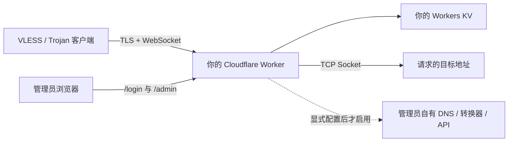

# EdgeTunnel

<p align="center">
  部署在 Cloudflare Workers 上、完全由运维者掌控的 VLESS / Trojan WebSocket 隧道。
</p>

<p align="center">
  <a href="README.md">英文</a> ·
  <a href="README.zh-CN.md">简体中文</a> ·
  <a href="README.es.md">西班牙语</a> ·
  <a href="README.fa.md">波斯语</a>
</p>

<p align="center">
  
  
  
  
</p>

> [!IMPORTANT]
> EdgeTunnel 仅用于合法研究、学习，以及访问你有权使用的系统。使用者有责任遵守所在地法律、Cloudflare 服务条款和相关网络策略。

## 项目是什么

EdgeTunnel 是一个模块化 Cloudflare Worker。它接收 **VLESS over WebSocket/TLS** 和 **Trojan over WebSocket/TLS** 连接，再通过 Cloudflare Socket API 建立出站 TCP 连接。配置、登录会话、地址列表和请求日志都保存在部署者自己的 Workers KV 中。

运行时不会从其他 GitHub 仓库或 CDN 下载代码、后台页面或配置。所有远程扩展默认关闭，只有管理员明确填写自己掌控的服务地址后才会启用。

### 当前功能状态

| 功能 | 状态 |
| --- | --- |
| VLESS over WebSocket/TLS | 支持 |
| Trojan over WebSocket/TLS | 支持 |
| Cloudflare Socket 出站 TCP | 支持 |
| 密码登录、KV 会话、注销 | 支持 |
| 带 token 的订阅 | 支持 |
| 本地地址列表订阅 | 支持 |
| Mihomo/Clash、Sing-box、Surge 转换 | 可选；需要管理员自建转换服务 |
| 图形化管理后台 | 尚未实现；当前页面提供本地 JSON/文本入口 |
| Hysteria2、TUIC 等原生 QUIC/UDP 协议 | 当前 Worker 架构不支持 |

> [!NOTE]
> 当前 `/admin` 是一个完全内置的最小管理入口，不是图形化节点面板。本说明会详细介绍在不依赖第三方面板的情况下如何查看节点、获得订阅和修改配置。

## 架构与信任边界



必须依赖：

- Cloudflare Workers 运行平台。
- 一个以 `KV` 为绑定名的 Workers KV 命名空间。

以下集成全部默认关闭：

- 用于 VLESS DNS 转发的管理员自有 DNS。
- 管理员自建的订阅转换服务与转换配置。
- 管理员自建的代理检测端点。
- 管理员自建的位置数据接口。
- 启用 ECH 时由管理员选择的 HTTPS DoH。
- Telegram 通知、远程伪装站和 Cloudflare 用量 API。

## 部署前准备

需要准备：

- 已启用 Workers 的 Cloudflare 账户。
- Node.js 和 npm。
- Git。
- 可以执行命令的终端。

Cloudflare 目前建议在每个项目中本地安装 Wrangler。下文统一使用 `npx`，确保优先调用项目内版本。

## 完整部署步骤

### 第 1 步：克隆仓库

```bash
git clone https://github.com/tianrking/Re_edgetunnel.git
cd Re_edgetunnel
```

### 第 2 步：在项目内安装最新版 Wrangler

```bash
npm install --save-dev wrangler@latest
npx wrangler --version
```

建议使用 Wrangler 4.x 或更高版本。

### 第 3 步：登录 Cloudflare

```bash
npx wrangler login
npx wrangler whoami
```

第一条命令会打开浏览器完成授权；第二条命令用来确认当前 Cloudflare 账户。

### 第 4 步：创建并绑定独立 KV

```bash
npx wrangler kv namespace create KV
```

命令成功后会输出 KV ID。打开 `wrangler.toml`，替换占位符：

```toml
[[kv_namespaces]]
binding = "KV"
id = "把刚才获得的-KV-ID-粘贴到这里"
```

`binding` 必须保持为 `KV`，因为程序通过 `env.KV` 访问它。

测试与生产请使用不同 KV。共用 KV 会同时共用配置、管理员会话、地址列表和日志。

### 第 5 步：检查代码并首次部署

```bash
npm test
npm run check
npx wrangler deploy --dry-run
npx wrangler deploy
```

首次部署用于创建 Worker。在还没有配置 `ADMIN` 时，HTTP 请求会返回 `503 Administrator password is not configured.`，这是主动保护，不是程序崩溃。

### 第 6 步：安全设置管理员密码

如果还没有强密码，可以在本机生成：

```bash
node -e "console.log(require('node:crypto').randomBytes(32).toString('base64url'))"
```

然后通过交互方式保存为 Cloudflare Secret：

```bash
npx wrangler secret put ADMIN
```

按照提示粘贴密码。不要把真实密码写进源码、README 或 `wrangler.toml`。`secret put` 会创建并立即部署一个新版本。

### 第 7 步：设置独立的 UUID

UUID 是 VLESS 凭据，也作为 Trojan 密码使用。生成一个 RFC 4122 v4 UUID：

```bash
node -e "console.log(require('node:crypto').randomUUID())"
```

保存为 Secret：

```bash
npx wrangler secret put UUID
```

`ADMIN` 和 `UUID` 必须使用两个不同的值。更换 UUID 后，旧节点和旧订阅里的凭据会立即失效。

确认两个 Secret 名称已经存在：

```bash
npx wrangler secret list
```

Cloudflare 只会显示 Secret 名称，不会回显内容。

### 第 8 步：打开 Worker

Wrangler 会输出类似下面的地址：

```text
https://edgetunnel.<你的-workers-子域>.workers.dev
```

根路径默认显示 nginx 风格的伪装页，这是正常行为。应访问：

```text
https://edgetunnel.<你的-workers-子域>.workers.dev/login
```

使用 `ADMIN` 密码登录，然后进入 `/admin`。

## 首次使用：获取节点和订阅

### 获取单节点链接

登录后：

1. 打开 `/admin`。
2. 点击 **Configuration JSON**。
3. 找到顶层字段 `LINK`。
4. 完整复制 `vless://...` 或 `trojan://...`。
5. 导入支持相应协议的客户端。

默认生成 VLESS。链接中已经包含 Worker 域名、TLS、WebSocket、路径和 UUID。

### 获取订阅链接

在同一份配置 JSON 中找到：

```text
优选订阅生成.TOKEN
```

将它拼成：

```text
https://你的域名/sub?token=你的TOKEN
```

订阅 URL 本身就是凭据，不能公开发布、截图分享或提交到 Git。

### 支持的订阅输出

| 输出类型 | URL 后缀 | 条件 |
| --- | --- | --- |
| 浏览器直接显示原始节点 | `/sub?token=TOKEN` | 不依赖外部服务 |
| Base64 节点订阅 | `/sub?token=TOKEN&base64` | 不依赖外部服务 |
| Mihomo/Clash YAML | `/sub?token=TOKEN&clash` | 必须配置自建 `SUBAPI` 和 `SUBCONFIG` |
| Sing-box JSON | `/sub?token=TOKEN&singbox` | 必须配置自建 `SUBAPI` 和 `SUBCONFIG` |
| Surge 配置 | `/sub?token=TOKEN&surge` | 必须配置自建 `SUBAPI` 和 `SUBCONFIG` |
| Quantumult X | `/sub?token=TOKEN&quanx` | 必须配置自建 `SUBAPI` 和 `SUBCONFIG` |
| Loon | `/sub?token=TOKEN&loon` | 必须配置自建 `SUBAPI` 和 `SUBCONFIG` |

Mihomo、Sing-box、Surge 等是客户端配置格式，不是 Worker 新增的入站网络协议。没有配置自建转换器时，转换请求会明确返回 HTTP 501，不会偷偷调用公共转换站。

## 当前管理页的使用方法

管理接口需要有效的 KV 会话。登录会话有效期为 24 小时，执行注销后立即撤销。

| 路径 | 方法 | 用途 |
| --- | --- | --- |
| `/login` | GET、POST | 显示本地登录页并创建会话 |
| `/admin` | GET | 最小化本地管理入口 |
| `/admin/config.json` | GET | 查看有效配置、节点 `LINK` 和订阅 TOKEN |
| `/admin/config.json` | POST | 将完整配置 JSON 保存到 KV |
| `/admin/ADD.txt` | GET | 查看已保存地址或本地生成的备用地址 |
| `/admin/ADD.txt` | POST | 保存自己的地址列表 |
| `/admin/log.json` | GET | 查看请求日志 |
| `/admin/init` | POST | 把 `config.json` 重置为默认值，不删除地址和日志 |
| `/admin/check` | GET | 使用自有检测端点测试上游 SOCKS5/HTTP 代理 |
| `/logout` | GET | 撤销当前会话并清除 Cookie |

所有修改配置的 POST 都必须携带同源 `Origin` 或 `Referer`，这是 CSRF 防护。

### 在浏览器中修改配置

登录后打开 `/admin`，再打开浏览器开发者控制台，执行：

```js
const config = await fetch('/admin/config.json').then((response) => response.json());

// 示例：把生成链接从 VLESS 切换为 Trojan。
config.协议类型 = 'trojan';

const response = await fetch('/admin/config.json', {
  method: 'POST',
  headers: { 'Content-Type': 'application/json' },
  body: JSON.stringify(config),
});

console.log(response.status, await response.text());
```

成功时返回 `{"success":true}`。重新打开 `/admin/config.json` 检查实际生效值。

### 保存自己的地址列表

每行格式：

```text
域名或IP:端口#显示名称
```

示例：

```text
example.com:443#主节点
203.0.113.10:443#IPv4 示例
[2001:db8::10]:443#IPv6 示例
```

以上地址属于文档示例，请替换为你有权使用的地址。非法格式以及不在 `1-65535` 范围内的端口会被忽略。

在已经登录的同源浏览器控制台执行：

```js
const addresses = `example.com:443#主节点
203.0.113.10:443#备用节点`;

const response = await fetch('/admin/ADD.txt', {
  method: 'POST',
  headers: { 'Content-Type': 'text/plain; charset=utf-8' },
  body: addresses,
});

console.log(response.status, await response.text());
```

### 重置主配置

```js
const response = await fetch('/admin/init', { method: 'POST' });
console.log(response.status, await response.text());
```

该操作只重置 `config.json`，不会删除 `ADD.txt`、日志、现有会话、Telegram 设置或 Cloudflare 用量设置。

## 重要配置字段

| JSON 字段 | 默认值 | 说明 |
| --- | --- | --- |
| `协议类型` | `vless` | 生成节点使用 `vless` 或 `trojan` |
| `支持协议` | `vless`、`trojan` | 由运行时维护的能力说明 |
| `传输协议` | `ws` | WebSocket 传输 |
| `HOSTS` | Worker 当前域名 | 生成订阅时使用的域名列表 |
| `跳过证书验证` | `false` | 设为 true 会关闭客户端证书校验，不建议 |
| `启用0RTT` | `false` | 在生成路径上添加 WebSocket early-data 参数 |
| `随机路径` | `false` | 本地生成订阅节点时使用 `/` 路径 |
| `Fingerprint` | `chrome` | 客户端 TLS 指纹提示 |
| `ECH` | `false` | 只有配置 HTTPS DoH 后才生成 ECH 客户端参数 |
| `优选订阅生成.local` | `true` | 从本地 KV 地址列表生成订阅 |
| `优选订阅生成.SUBNAME` | `edgetunnel` | 节点和订阅显示名称 |
| `优选订阅生成.SUBUpdateTime` | `3` | 建议客户端每多少小时更新 |
| `优选订阅生成.本地IP库.随机数量` | `16` | 没有保存地址时本地生成的备用数量 |
| `订阅转换配置.SUBAPI` | `null` | 自建订阅转换器根地址 |
| `订阅转换配置.SUBCONFIG` | `null` | 自有转换配置 HTTPS 地址 |
| `本地规则集URL` | `null` | 自有 Sing-box `.srs` 规则集根地址 |
| `客户端DNS` | `[]` | 明确写进 Clash 输出的自有 DNS 列表 |
| `TG.启用` | `false` | 配置凭据后开启 Telegram 请求通知 |

`HOST`、`UUID`、`PATH`、`LINK`、`TOKEN`、时间、用量和加载耗时属于运行时派生字段，读取时可能被 Worker 重新计算。

## 部署变量与可选集成

敏感内容必须使用 `wrangler secret put`。非敏感运行参数可以写在 `wrangler.toml` 的 `[vars]` 中。

| 变量 | 必需 | 用途 |
| --- | --- | --- |
| `ADMIN` | 是 | 管理员密码，必须保存为 Secret |
| `UUID` | 强烈建议 | RFC 4122 v4 的 VLESS/Trojan 凭据，保存为 Secret |
| `KEY` | 否 | 额外密钥输入及可选私有订阅捷径，应保存为 Secret |
| `HOST` | 否 | 订阅使用的多个域名，可用逗号或换行分隔 |
| `URL` | 否 | 根路径伪装：`nginx`、`1101` 或明确的 HTTPS 源站 |
| `PROXYIP` | 否 | 管理员选择的 TCP 回退代理地址 |
| `DNS_RESOLVER` | 否 | VLESS DNS 转发使用的自有 DNS |
| `DNS_RESOLVER_PORT` | 否 | DNS 端口，默认 `53` |
| `PROXY_CHECK_HOST` | 否 | 代理测试使用的自有 HTTP 端点主机 |
| `PROXY_CHECK_PORT` | 否 | 检测端口，默认 `80` |
| `PROXY_CHECK_PATH` | 否 | 检测路径，默认 `/` |
| `LOCATIONS_API` | 否 | 自有 HTTPS 位置数据接口 |
| `ECH_DOH_URL` | 否 | 仅在 ECH 查询时使用的明确 HTTPS DoH |
| `ALLOW_REMOTE_USAGE_API` | 否 | 必须为 `true` 才允许请求已保存的远程用量 API |

没有配置可选端点时，对应功能会关闭，不会自动选择隐藏的公共服务。

## 绑定自定义域名

将 Cloudflare 账户中已经管理的域名加入 `wrangler.toml`：

```toml
routes = [
  { pattern = "tunnel.example.com", custom_domain = true }
]
```

重新部署：

```bash
npx wrangler deploy
```

域名改变后需要重新打开 `/admin/config.json`。订阅 token 由域名和 UUID 派生，`workers.dev` 域名的 token 不能直接用于自定义域名。

## 更新与回滚

```bash
git pull --ff-only
npm test
npm run check
npx wrangler deploy --dry-run
npx wrangler deploy
```

查看版本或回滚：

```bash
npx wrangler versions list
npx wrangler rollback
```

执行破坏性配置操作前，应从已认证管理接口备份 `config.json` 和 `ADD.txt`。

## 协议边界

支持：

- VLESS over WebSocket，由 Cloudflare 终止 TLS。
- Trojan over WebSocket，由 Cloudflare 终止 TLS。
- Cloudflare Socket API 可以访问的 TCP 目标。
- 配置自有 DNS 后的 VLESS DNS 转发。
- SOCKS5 和 HTTP CONNECT 作为可选上游代理，不是客户端入站协议。

不支持：

- 需要原生 QUIC/UDP 的 Hysteria2、TUIC。
- WireGuard 入站隧道。
- VLESS Reality，因为 TLS 在 Cloudflare 终止。
- 原生 TCP、gRPC、HTTP/2 或 HTTP/3 代理入站。
- 任意 UDP 转发；只处理明确配置的 VLESS DNS 路径。

增加客户端输出格式，不等于 Worker 核心增加了新的网络协议。

## 安全模型

- 登录会话使用随机 256 位 token，KV 只保存经 SHA-256 派生的会话键。
- Cookie 设置为 `HttpOnly`、`Secure`、`SameSite=Strict`。
- 会话 24 小时过期，注销时立即删除。
- 管理员修改请求必须来自同源页面。
- 订阅接口必须提供由 Worker 域名和 UUID 派生的 token。
- 请求日志会移除 URL 中的密码、token 和 API 密钥参数。
- 所有远程运行时集成均为显式选择。

建议：

- 不要提交 `ADMIN`、`UUID`、API token、Cookie 或订阅链接。
- 保持 `跳过证书验证=false`。
- 测试和生产使用不同 Worker 与 KV。
- 管理密码泄露后立即更换；已有会话仍会存活到注销或 24 小时到期。
- 节点泄露后更换 UUID，并让所有客户端重新导入。
- Cloudflare API Token 只授予最小必要权限。

## 常见问题排查

### 根路径只有 “Welcome to nginx”

这是默认伪装页。请访问 `/login`。

### `/admin` 只有几个链接

这是当前内置管理页的实际功能。节点和 token 位于 `/admin/config.json`，修改方法见上面的浏览器控制台示例。当前版本没有宣称包含完整图形化后台。

### 返回 `503 Administrator password is not configured`

```bash
npx wrangler secret put ADMIN
```

完成后等待新版本部署。

### 提示 KV 绑定不存在

检查 `wrangler.toml` 是否填入真实 KV ID，并确认绑定名严格为 `KV`。

### 返回 `403 Invalid Token`

从当前域名的 `/admin/config.json` 重新复制 token。自定义域名和 `workers.dev` 域名使用不同 token。

### Clash、Sing-box 或 Surge 返回 `501`

只有 `订阅转换配置.SUBAPI` 和 `SUBCONFIG` 都指向管理员控制的 HTTPS 服务后才会开启。原始/Base64 订阅不需要转换器。

### 代理测试返回 `503`

先配置自有 `PROXY_CHECK_HOST`、`PROXY_CHECK_PORT`、`PROXY_CHECK_PATH`。项目不会自动连接公共检测站。

### WebSocket 已连接但目标没有响应

检查 UUID/密码、TLS host/SNI、WebSocket host/path、目标端口、Cloudflare 日志，以及 Cloudflare 是否允许连接该出站目标。

实时查看生产日志：

```bash
npx wrangler tail
```

## 开发与验证

```bash
npm run check
npm test
```

Cloudflare 真实环境验证脚本：

```bash
npm run test:cloudflare:http
npm run test:cloudflare
```

真实环境脚本需要专门创建的测试 Worker、测试 KV 和测试凭据。不要对生产数据运行破坏性测试。

## 项目目录

```text
src/
├── index.js                 # Worker 入口与路由
├── config.js                # 默认配置、KV、节点、日志
├── controllers/
│   ├── auth.js              # 登录、会话、同源校验、注销
│   ├── admin.js             # 管理接口
│   └── sub.js               # 订阅生成和转换
├── core/proxy.js            # WebSocket 与出站 Socket 生命周期
├── protocols/
│   ├── parsers.js           # VLESS、Trojan 解析
│   └── socks5.js            # 可选 SOCKS5/HTTP 上游
└── utils/                    # 页面、地址解析、格式补丁、工具
```

## 致谢

本项目受到以下社区工作的启发：

- [cmliu/edgetunnel](https://github.com/cmliu/edgetunnel)
- [zizifn/edgetunnel](https://github.com/zizifn/edgetunnel)

当前运行时代码已在本仓库内模块化，不会在运行期间加载上述仓库。

## 许可证与免责声明

许可证见 [LICENSE](LICENSE)。只能将本软件用于合法用途，以及你被授权访问的网络和系统。维护者不对滥用或由此造成的损失负责。
